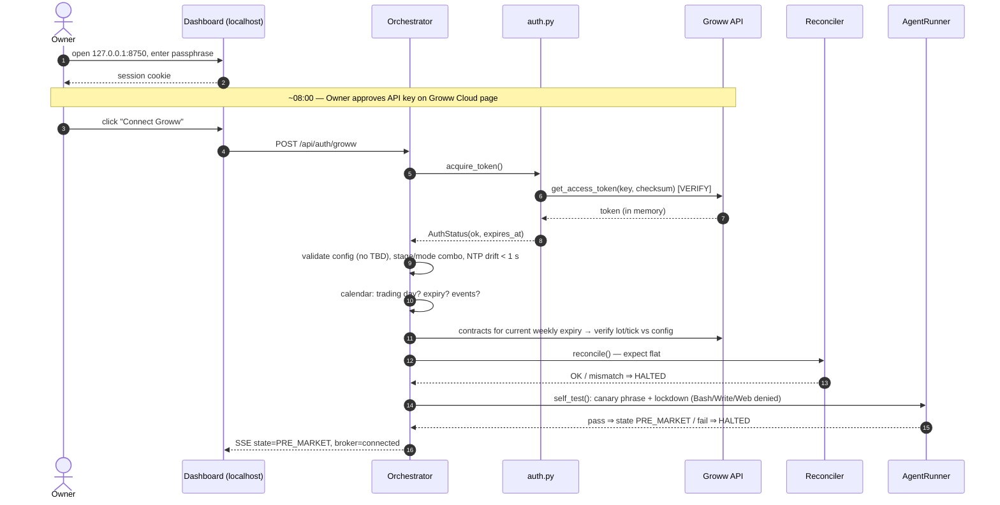
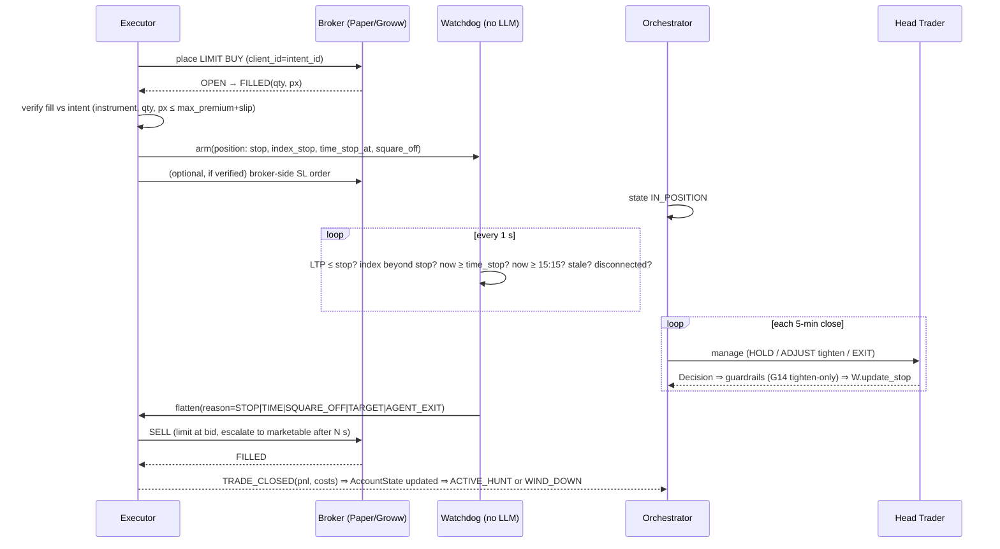
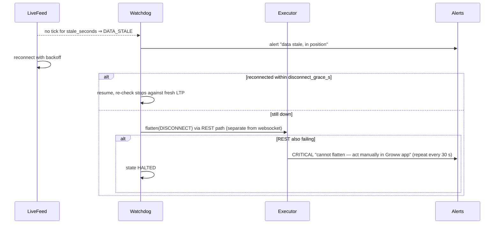
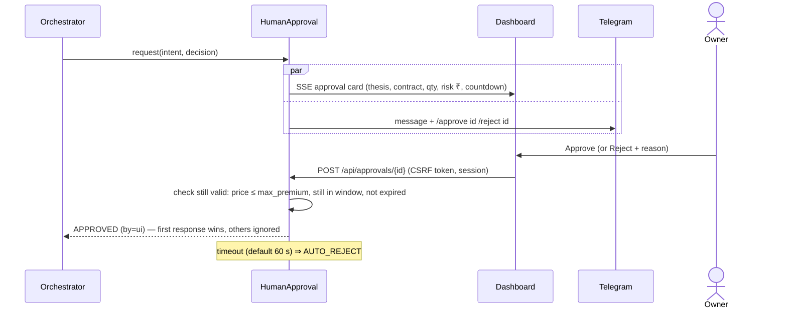

# DESIGN.md — Agentic Intraday Nifty Options Trading System

> Status: **DRAFT v0.1 — awaiting owner approval.** No implementation code is written until this is approved (MASTER_PLAN §0.2, §17.3).
> Source spec: `MASTER_PLAN.md` v1.0. Anything tagged `[VERIFY]` is unconfirmed and must be checked against official docs or a live test in Phase 1.
> Nothing here is financial advice.

---

## 0. Read-back: ambiguities and conflicts found in MASTER_PLAN.md

| # | Where | Issue | Proposed resolution |
|---|---|---|---|
| A1 | §5 | Says "three modes" but lists four (`BACKTEST`, `REPLAY`, `PAPER`, `LIVE`). | Four modes. |
| A2 | §6, owner request | The spec has **no UI**; the owner has asked for one. S2 approval is "Telegram or CLI". | Add a **local web dashboard** (`src/tradingagent/ui/`), see §6. Telegram stays as the phone channel and kill switch. The UI is a *client* of the orchestrator; it cannot bypass guardrails. |
| A3 | §4 vs §8 | "Stage" (S0–S3) and "mode" (PAPER/LIVE) overlap. | `stage.yaml` holds both; valid combos are enforced: S1⇒PAPER, S2/S3⇒LIVE. Any other combo fails boot. |
| A4 | §8 | `OPEN_OBSERVE` "no entries" and `entry_window.start: 09:30` say the same thing twice. | `schedule.yaml` is the single source; guardrail G03 reads it. |
| A5 | §12 | `min_contract_volume`, `min_scorecard_total`, `max_slippage_pct` are `TBD`. | Boot **fails** if any enforcement value is `TBD` in PAPER/LIVE. BACKTEST/REPLAY may sweep them. |
| A6 | §9.3 | Scorecard has 7 items × 0–2 = max 14, but there is no weighting rule. | Plain sum; the threshold lives in `risk.yaml`. |
| A7 | §7.7 | "Prefer broker-side stop orders" but SL/SL-M availability for options on Groww is unknown. | The watchdog is always the primary enforcer. Broker-side SL is an *extra* layer, added only once Phase 1 has verified it. |
| A8 | §2 | Lot size 65 and Tuesday expiry are from memory. | Loaded from contract data at boot (`get_contracts`). The config value is only a cross-check, and a mismatch halts boot. |
| A9 | §6 | The repo root is named `trading-agent/`, but the working folder is `trading/suzlon/`. | Use the current folder as the repo root. The package is still `tradingagent`. |
| A10 | §9.2 | The Reviewer needs "file write to `journal/` only", but §15 says the agent has no file write. | The Reviewer runs as a **separate agent process** with a write tool scoped to `journal/reviews/`. The trading agents get no write access at all. |

---

## 1. Final repository layout (deviations from §6 marked ★)

```
suzlon/                                  ★ repo root (A9)
├── CLAUDE.md  MASTER_PLAN.md  README.md  pyproject.toml  uv.lock ★  .env.example
├── config/  risk.yaml instruments.yaml costs.yaml schedule.yaml stage.yaml models.yaml ui.yaml★
├── playbook/ 01..08 *.md
├── .claude/agents/*.md   .claude/skills/*/SKILL.md
├── agent_workdir/ ★                     # cwd for the SDK: playbook symlink + charts/, NO secrets
├── src/tradingagent/
│   ├── core/ ★                          # shared types, clock, events, errors (no deps)
│   │   ├── types.py  clock.py  events.py  errors.py  modes.py
│   ├── config/  broker/  data/  features/  tools/  agent/
│   ├── guardrails/  execution/  orchestrator/  sim/  journal/  alerts/
│   ├── ui/ ★                            # local dashboard (FastAPI + HTMX), §6
│   │   ├── app.py  routes.py  auth.py  sse.py  templates/  static/
│   └── cli.py
├── tests/ unit/ integration/ failure_injection/ replay_regression/ golden/ ★
├── data/  journal/  runtime/ ★          # runtime/: state.json, HALT flag, locks (gitignored)
└── docs/  DESIGN.md  DECISIONS.md  DATA_FEASIBILITY.md
```

Justifications:
- `core/` holds the types every layer shares, which avoids circular imports. It is kept dependency-free so `features/` stays pure.
- `agent_workdir/` is a clean cwd for the SDK, as required by §9.1 ("no secrets in working dir").
- `runtime/` holds mutable on-disk state (stage, HALT flag), kept separate from config.
- `ui/` is explained in §6.
- `uv.lock` pins dependencies (§15).

**Import rules (enforced by an `import-linter` contract in CI):**
- `features/` imports only `core/`, numpy, and pandas.
- `growwapi` is imported **only** in `broker/groww_adapter.py` and `broker/auth.py`.
- `broker.groww_adapter.GrowwBroker.place_order` may be called only from `execution/executor.py`.
- `agent/`, `tools/`, and `ui/` may never import `broker/groww_adapter` or `broker/auth`.

---

## 2. Modes and dependency injection

One composition root (`orchestrator/wiring.py`) builds the object graph per mode. **Trading logic is identical in every mode**; only these five ports change:

| Port (interface) | BACKTEST | REPLAY | PAPER | LIVE |
|---|---|---|---|---|
| `Clock` | `SimClock` (steps candles) | `ReplayClock` (as-of) | `WallClock` IST | `WallClock` IST |
| `MarketData` | `StoreMarketData` (parquet) | `StoreMarketData` + masking | `LiveMarketData` (websocket) | `LiveMarketData` |
| `DecisionSource` | `BaselineStrategy` (ORB/VWAP) | `AgentRunner` | `AgentRunner` | `AgentRunner` |
| `Broker` (orders) | `SimBroker` (fills.py) | `SimBroker` | `PaperBroker` | `GrowwBroker` |
| `ApprovalGate` | `AutoApprove` | `AutoApprove` | `AutoApprove` (S1) | `HumanApproval` (S2) / `AutoApprove` (S3) |

```python
# core/clock.py
class Clock(Protocol):
    def now(self) -> datetime: ...                  # tz-aware Asia/Kolkata
    async def sleep_until(self, t: datetime) -> None: ...

# core/modes.py
class Mode(StrEnum): BACKTEST="BACKTEST"; REPLAY="REPLAY"; PAPER="PAPER"; LIVE="LIVE"
class Stage(StrEnum): S0="S0"; S1="S1"; S2="S2"; S3="S3"
```

---

## 3. Core data classes (`core/types.py`)

```python
@dataclass(frozen=True)
class Candle:  ts: datetime; open: float; high: float; low: float; close: float; volume: int; oi: int | None = None

@dataclass(frozen=True)
class Instrument:
    groww_symbol: str; exchange: str; segment: str        # [VERIFY formats]
    underlying: str; expiry: date | None; strike: float | None
    opt_type: Literal["CE","PE"] | None; lot_size: int; tick_size: float

@dataclass(frozen=True)
class Quote:  instrument: Instrument; ts: datetime; ltp: float; bid: float | None; ask: float | None
              volume: int | None; oi: int | None; iv: float | None

@dataclass(frozen=True)
class Snapshot:                      # everything an agent cycle may see, frozen at as_of
    as_of: datetime; snapshot_hash: str; index_candles: dict[str, pd.DataFrame]   # "1m","5m","15m","1d"
    chain: ChainSnapshot | None; account: AccountState; plan: GamePlan | None
    position: Position | None; last_guardrail_verdict: Verdict | None

@dataclass
class AccountState:  capital: float; realized_pnl_today: float; unrealized_pnl: float
                     trades_today: int; consecutive_losses: int; last_stop_out_at: datetime | None
                     week_pnl: float; peak_equity: float; funds_available: float

@dataclass
class Position:  intent_id: str; instrument: Instrument; qty: int; avg_price: float
                 entry_ts: datetime; stop_premium: float; stop_index: float | None
                 target_premium: float | None; time_stop_at: datetime; setup_id: str

@dataclass(frozen=True)
class OrderIntent:                   # output of guardrails, input to executor
    intent_id: str                   # uuid4, also the client order id (idempotency)
    action: Literal["ENTER","EXIT","ADJUST"]; instrument: Instrument; side: Literal["BUY","SELL"]
    qty: int                         # computed by guardrails/sizing.py, never by the agent
    limit_price: float; stop_premium: float; target_premium: float | None
    time_stop_at: datetime; decision_id: str

@dataclass(frozen=True)
class RuleResult:  rule_id: str; passed: bool; reason_code: str; detail: str
@dataclass(frozen=True)
class Verdict:     approved: bool; results: list[RuleResult]; intent: OrderIntent | None
```

`Decision` (pydantic, `agent/decision.py`) mirrors §9.3 exactly. Its validators:
- `no_trade_reason` is required when `action == NO_TRADE`.
- `contract`, `entry`, `stop`, and `target` are required when `action == ENTER`.
- For a CE, `stop.premium < entry.max_premium`, and likewise for a PE.
- `evidence` is non-empty for ENTER/ADJUST/EXIT.
- `setup_id` must be in the set parsed from `playbook/03_setups.md`.
- `extra="forbid"`, so a stray `quantity` field is **rejected**, not ignored.

---

## 4. Module specifications

### 4.1 `config/`
```python
def load_config(root: Path = Path("config")) -> AppConfig    # pydantic; fails on unknown keys, TBD in PAPER/LIVE
class AppConfig(BaseModel): risk: RiskConfig; instruments: InstrumentsConfig; costs: CostsConfig
                            schedule: ScheduleConfig; stage: StageConfig; models: ModelsConfig; ui: UIConfig
```
Config is read-only at runtime. The effective config hash is logged with every event.

### 4.2 `broker/`
```python
class Broker(ABC):
    async def get_ltp(self, instruments: list[Instrument]) -> dict[str, float]
    async def get_quote(self, instrument: Instrument) -> Quote
    async def get_historical_candles(self, instrument, start: datetime, end: datetime, interval: str) -> list[Candle]
    async def get_expiries(self, underlying: str, year: int, month: int) -> list[date]
    async def get_contracts(self, underlying: str, expiry: date) -> list[Instrument]
    async def get_option_chain(self, underlying: str, expiry: date) -> ChainSnapshot | None
    async def place_order(self, intent: OrderIntent) -> BrokerOrder          # LIVE only via executor
    async def modify_order(self, order_id: str, **changes) -> BrokerOrder
    async def cancel_order(self, order_id: str) -> BrokerOrder
    async def get_order(self, order_id: str) -> BrokerOrder
    async def get_positions(self) -> list[BrokerPosition]
    async def get_margin(self) -> MarginInfo
    async def subscribe(self, instruments, on_tick: Callable[[Quote], None]) -> None
    async def unsubscribe(self, instruments) -> None
```
- `GrowwBroker` provides a token bucket per endpoint class (limits loaded from config after Phase 1 verifies them), retry with exponential backoff and jitter on transient errors only, and a circuit breaker (5 failures in 60 s ⇒ `BROKER_DISCONNECT` event). SDK exceptions map to `BrokerAuthError`, `BrokerRateLimited`, `BrokerRejected`, and `BrokerUnavailable`.
- `PaperBroker` fills against the live quote using `sim/fills.py` (crosses the spread, adds a slippage model) and never touches the network for orders.
- `auth.py` is covered in §5.1 (login flow).

### 4.3 `data/`
```python
# history.py
async def download(broker, instrument, start, end, interval, store: Store) -> DownloadReport   # chunked, resumable
# store.py  (parquet partitioned by symbol/interval/date + DuckDB views)
class Store: def write_candles(...); def read_candles(symbol, interval, start, end, as_of=None) -> pd.DataFrame
             def write_chain_snapshot(...); def read_chain(as_of) -> ChainSnapshot
# validate.py
def validate_day(df: pd.DataFrame, interval: str, cal: TradingCalendar) -> QualityReport
# live_feed.py
class LiveFeed: async def run(); def candles(interval) -> pd.DataFrame; last_update_age() -> float
                # emits CANDLE_CLOSED(interval, ts) and DATA_STALE events on the EventBus
                # L5 stall watchdog: no callback for stall_after_s ⇒ close socket, new generation, re-subscribe
                #    (bounded backoff); callbacks tagged with an old generation are dropped; authority returns
                #    only after recovery_min_callbacks fresh callbacks. Pre-open grace avoids reconnect loops.
                # L7 per-instrument dedupe via callback metadata key; bounded emit rate; decisions before archive.
                # L6 spot-vs-futures consistency: index flat/diverging while future moves ⇒ INDEX_SUSPECT event
# recorder.py  (L8: first Phase 1 deliverable — Groww history has no bid/ask)
class Recorder: async def run_day()   # bid/ask/depth for ATM±N strikes + chain/OI/IV/VIX/futures → store
# instruments.py (L9)
def snapshot_master(broker, store) -> MasterSnapshot   # daily Groww instrument master + SHA-256; trades cite it
# calendar.py
class TradingCalendar: is_trading_day(d); session(d) -> (open, close); expiries(month); events(d) -> list[Event]
```
`Store.read_candles(as_of=T)` never returns rows with `ts > T`, **and never returns a candle whose close time is after T**. For example, when `as_of` is 10:07 the 10:05 5-min candle is still forming, so it is excluded. This is the single chokepoint for look-ahead.

### 4.4 `features/` (pure)
Each function has the form `f(df: pd.DataFrame, **params) -> pd.DataFrame | dataclass`, with no I/O and no clock. The catalog is §11 of the master plan: `indicators.py` (ema, vwap, rsi, macd, atr, bollinger, supertrend, adx, roc, obv), `levels.py` (prev_day, prev_week, opening_range, gap, swings, pivots_cpr, round_numbers), `volume_profile.py`, `options_chain.py` (pcr, max_pain, oi_change, straddle, iv_percentile), `greeks.py` (bs_price, bs_greeks, implied_vol), `day_type.py`, `regime.py`, and `charts.py` (mplfinance → PNG; this one is not pure because it writes a file, so it takes an explicit `out_path`).

Generic look-ahead test: for every registered feature and a random T, `f(df)[:T] == f(df[:T])`.

### 4.5 `tools/` (MCP server for the agent)
```python
def build_tool_server(ctx: ToolContext) -> McpSdkServerConfig      # create_sdk_mcp_server(...) [VERIFY]
@dataclass class ToolContext: snapshot: Snapshot; store: Store; cfg: AppConfig; guardrails: GuardrailEngine
                              chart_dir: Path; call_log: list[ToolCall]
```
Every tool reads `ctx.snapshot.as_of`, so the agent cannot pass a time. The tools are the ones in master plan §7.4, and they return compact JSON of 2 KB or less.
- `propose_decision(decision_json)` → validates → `GuardrailEngine.evaluate` → returns `{"approved": bool, "reasons": [...], "qty": int|None}` and stores the verdict in `ctx`.
- There is **no** order tool.

### 4.6 `agent/`
```python
# runner.py
class AgentRunner(DecisionSource):
    async def game_plan(self, snap: Snapshot) -> GamePlan
    async def decide(self, snap: Snapshot) -> DecisionResult     # Decision + verdict + usage + tool calls
    async def self_test(self) -> None                            # canary + lockdown tests at boot
# builds ClaudeAgentOptions(
#    cwd="agent_workdir", setting_sources=["project"], mcp_servers={"trade": server},
#    allowed_tools=[mcp__trade__*], disallowed_tools=["Bash","Write","Edit","WebFetch","WebSearch","NotebookEdit",...],
#    agents={context-analyst, chart-analyst, options-analyst, risk-officer}, can_use_tool=allowlist_guard,
#    hooks={PreToolUse:[audit, deny_unknown], PostToolUse:[audit]}, model=models.entry) [VERIFY all names]
# decision.py  → Decision model + parse_decision(text) -> Decision | ParseError
# hooks.py     → audit_hook (JSONL), deny_hook (allowlist), budget_hook (daily token cap ⇒ deny ⇒ NO_TRADE)
# prompts.py   → cycle prompt = snapshot summary + last verdict + plan (playbook comes via CLAUDE.md/settings)
# cadence.py   → should_run_agent(snap, prescreen: PrescreenResult, state) -> (bool, model_tier)
```
Parse failure is retried once with the error; after a second failure the result is `NO_TRADE` plus an alert. An agent timeout (config, default 90 s) also gives `NO_TRADE`.

### 4.7 `guardrails/`
```python
Rule = Callable[[Decision, AccountState, MarketState, AppConfig], RuleResult]
RULES: list[Rule] = [g01_stage_mode, g02_not_halted, ..., g15_exits_scheduled, g16_revalidate, g17_move_vs_cost]
class GuardrailEngine: def evaluate(self, d, acct, mkt, cfg) -> Verdict   # runs ALL rules; any ENFORCE fail ⇒ reject
# sizing.py
def size_position(entry: float, stop: float, lot: int, capital: float, risk_pct: float,
                  max_lots: int, max_outlay_pct: float) -> SizingResult   # lots = floor(risk_budget / ((entry-stop)*lot))
```
If `lots == 0`, the decision is rejected under G10 (reason `RISK_TOO_WIDE`).

**Rule authority (lesson L2).** Each rule has `authority: ENFORCE | SHADOW`, set in `config/risk.yaml → rule_authority`:
- `SHADOW` failures are logged in the Verdict and shown in the UI, but never reject.
- G01–G15 are `ENFORCE`.
- **New rules start as `SHADOW`.** They are promoted to `ENFORCE` only by an ADR citing out-of-sample evidence.

The reason: SideHustle found that universal hard thresholds rejected big winners.

- **G16 decision-time revalidation** (L3, SHADOW). At the moment of entry, compute the index move since the evidence candle's close in ATR units, and the premium change against the reference. Fail if the move already consumed is ≥ `max_move_consumed_atr`.
- **G17 expected move vs cost** (L4, SHADOW). Fail if `(target_premium − entry_premium) × qty < k × round_trip_cost`, using `sim/costs.py`.

### 4.8 `execution/`
```python
class Executor:   async def submit(self, intent: OrderIntent) -> ExecutionResult     # idempotent on intent_id
                  async def flatten(self, reason: str) -> None
class Watchdog:   async def run(self)   # 1 s loop on LiveFeed LTP; NO LLM imports (enforced by import-linter)
                  # checks: hard stop (premium & index), time stop, square-off time, daily loss, DATA_STALE,
                  #         BROKER_DISCONNECT > N s, reconcile mismatch, HALT flag,
                  #         INDEX_SUSPECT (L6: spot frozen/diverging vs futures ⇒ block entries, recycle feed)
                  #         tracks per-position MFE/MAE on the executable bid (L4)
class Reconciler: async def reconcile(self) -> ReconcileReport   # broker vs local; mismatch ⇒ HALTED
class ApprovalGate(Protocol): async def request(self, intent, decision) -> ApprovalResult  # timeout ⇒ reject
class HumanApproval(ApprovalGate)   # fans out to UI + Telegram; first response wins; logs who/where/why
```
Order lifecycle: `PENDING → OPEN → PARTIAL → FILLED | REJECTED | CANCELLED`. An unfilled limit entry is cancelled after `entry_ttl_seconds`. A partial fill is accepted, and the stop is armed on the filled qty.

The **only** call site of live `place_order` is `Executor._send` (tested by AST scan). Live mode requires all three of: `stage.yaml mode: LIVE`, env `TRADING_LIVE_ENABLED=I_UNDERSTAND`, and a stage-gate record in `runtime/state.json`.

### 4.9 `orchestrator/`
```python
class DayState(StrEnum): BOOT, PRE_MARKET, OPEN_OBSERVE, ACTIVE_HUNT, IN_POSITION, WIND_DOWN, SQUARE_OFF, POST_MARKET, HALTED, CLOSED
class TradingDay:
    async def run(self)                          # main loop, driven by Clock + EventBus
    async def transition(self, to: DayState, reason: str)  # logged; HALTED is sticky until owner resume
    async def decision_cycle(self, candle_ts: datetime)
class EventBus: publish(evt: Event); subscribe(type, handler)   # in-process asyncio; UI subscribes via SSE
```

### 4.10 `sim/`
`costs.py` (`CostModel.round_trip(buy_px, sell_px, qty) -> CostBreakdown`), `fills.py`, `backtester.py`, `baselines.py` (`orb_decision(snap)`, `vwap_trend_decision(snap)` → `Decision`), and `replay.py` (`ReplayHarness.run(days, repeats, masking) -> ReplayReport`).

### 4.11 `journal/`, `alerts/`
- `journal/`: `EventLogger.write(event)` → `journal/events/YYYY-MM-DD.jsonl`, `journal_writer.write_daily(date)` → `journal/daily/YYYY-MM-DD.md`, and `metrics.compute(trades) -> MetricsReport`.
- `alerts/`: `Telegram.send(msg)`, `Telegram.on_command("/kill" | "/status" | "/approve <id>" | "/reject <id>")` (owner chat-id allowlist).

---

## 5. Code flow — sequence diagrams

### 5.1 Login / boot (how you log in each day)

There are **two separate logins**:

1. **Dashboard login (local).** You open `http://127.0.0.1:8750` and enter a passphrase. The passphrase is set once with `tradingagent ui set-passphrase` and stored as an argon2 hash in `runtime/ui_auth.json`. This creates a session cookie (HttpOnly, SameSite=Strict, 12 h). The server binds to localhost only.
2. **Groww broker login (daily)** `[VERIFY entire flow in Phase 1]`. Groww access tokens expire daily. Two supported flows:
   - **(Recommended) API key + secret with daily approval.** Each morning you approve the key on the Groww Cloud API Keys page. You then click **"Connect Groww"** on the dashboard, or run `tradingagent auth`. `auth.py` builds the checksum from the secret and a timestamp, calls the SDK token endpoint, and keeps the token **in memory only**.
   - **TOTP flow.** This is fully automatable, but it stores your TOTP seed on disk and removes the human check each morning. It is off by default and needs an explicit owner decision (Q3).

   Secrets come from env (`GROWW_API_KEY`, `GROWW_API_SECRET`) and never reach the UI, logs, or agent. The UI only ever sees `{connected: bool, expires_at, user_id_masked}`.


If the token is invalid, the system stays in `BOOT` and no trading starts (§7.1). The dashboard shows a red "Groww not connected" banner with the Connect button.

### 5.2 Pre-market game plan
```mermaid
sequenceDiagram
    participant O as Orchestrator
    participant D as Data/Recorder
    participant H as Head Trader
    participant C as Context analyst
    O->>D: levels(PDH/PDL/PDC, pivots), chain snapshot, VIX, calendar events
    O->>O: code hard-skip list (event blackout, expiry rule, data quality)
    alt hard skip
        O->>O: plan = SKIP_TODAY (code), agent not called
    else
        O->>H: game_plan(snapshot)
        H->>C: Task: context + TRADE/SKIP recommendation
        C-->>H: context report (tools only)
        H-->>O: GamePlan{day_type_hypothesis, scenarios[], TRADE_TODAY|SKIP_TODAY, risk_budget}
    end
    O-->>O: journal PLAN event; UI shows plan card
```

### 5.3 Decision cycle (every 5-min close in ACTIVE_HUNT / IN_POSITION)
```mermaid
sequenceDiagram
    participant F as LiveFeed
    participant O as Orchestrator
    participant P as Prescreen (code)
    participant H as Head Trader
    participant S as Subagents
    participant T as Tools (MCP)
    participant GR as GuardrailEngine
    participant AP as ApprovalGate
    participant X as Executor
    F->>O: CANDLE_CLOSED 5m @ T
    O->>O: build Snapshot(as_of=T), hash
    O->>P: prescreen(snapshot) (setup conditions from 03_setups.md)
    alt nothing forming and flat
        P-->>O: skip ⇒ log CYCLE_SKIPPED (no LLM cost)
    else
        O->>H: decide(snapshot) [model tier from cadence]
        H->>T: get_levels / get_indicators / ...
        H->>S: chart / options analysts
        H->>S: risk-officer (argue against)
        H->>T: propose_decision(json)
        T->>GR: evaluate (G01..G15) + size
        GR-->>T: Verdict
        T-->>H: verdict only
        H-->>O: final Decision text
        O->>O: parse (retry once) ⇒ Decision | NO_TRADE+alert
        O->>GR: re-evaluate authoritatively (never trust tool-side verdict)
        alt rejected
            O-->>O: log GUARDRAIL_REJECT; reasons fed into next snapshot
        else approved
            O->>AP: request(intent)   (S1 auto, S2 human, S3 auto)
            AP-->>O: approved / rejected / timeout
            O->>X: submit(intent)
        end
    end
    O-->>O: journal DECISION event; UI updates
```

### 5.4 Entry through exit (watchdog)


### 5.5 Broker disconnect mid-trade


### 5.6 S2 human approval


### 5.7 End of day
```mermaid
sequenceDiagram
    participant W as Watchdog
    participant O as Orchestrator
    participant R as Reconciler
    participant M as Metrics
    participant RV as Reviewer agent
    W->>W: 15:15 SQUARE_OFF: cancel pendings, flatten
    O->>R: reconcile (must be flat)
    O->>M: day P&L, costs, R-multiples, drift vs backtest expectation, stage-gate progress
    O->>RV: review(events JSONL) [separate process, write only journal/reviews/]
    RV-->>O: journal md + mistake taxonomy + playbook diff proposals (not applied)
    O-->>O: backup data/ + journal/; state CLOSED
```

### 5.8 Kill switch
There are three triggers: the `runtime/HALT` file, Telegram `/kill`, and the dashboard **KILL** button (with confirmation).

All three end in `Orchestrator.halt(reason)`, which runs these steps in order:
1. Set the HALT flag.
2. Cancel all open orders.
3. Flatten.
4. Reconcile.
5. Move to state `HALTED`.
6. Alert.

Resuming needs the owner to act, either `tradingagent resume --reason "..."` or the UI Resume button with a typed reason.

---

## 6. UI design (new, per owner request)

### 6.1 Technology
**FastAPI + Jinja2 + vanilla JS** (HTMX dropped, see ADR-002), with Server-Sent Events for live updates and lightweight-charts (TradingView OSS) for charts. Reasons:
- It is a single Python process and stack, with no Node build step.
- It runs in-process with the orchestrator (one asyncio loop), so the UI can read state directly.
- It is easy to test with FastAPI's `TestClient`.

For BACKTEST/REPLAY there is a separate `tradingagent ui --reports` mode, which only browses reports.

### 6.2 Safety rules for the UI
- It binds to `127.0.0.1` only. Phone access is through Telegram, not by exposing the UI.
- It needs the passphrase session plus a CSRF token on every POST.
- The UI can **only** do these writes: connect Groww, approve/reject a proposal, kill, resume (with reason), and acknowledge alerts. It **cannot** edit config, playbook, stage, stops, or quantity.
- Approval re-runs validity checks server-side, so a stale click is rejected.
- If the UI crashes, trading is unaffected: the watchdog and orchestrator do not depend on it.

### 6.3 Screens
| Screen | Contents |
|---|---|
| **Login** | Passphrase field. |
| **Home / Live** (default) | Top bar: day state, stage/mode badge (PAPER in amber, LIVE in red), Groww connection + token expiry, data freshness, clock, **KILL** button. Left: Nifty 5-min chart with VWAP, EMA 9/20, PDH/PDL, OR box, entry/stop/target lines. Right: game plan card, position card (P&L, stop, time-stop countdown), risk budget meters (daily loss used, trades today, cool-off timer). Bottom: live decision feed. |
| **Approvals** (S2) | Pending card with thesis, scorecard, contract, **code-computed qty**, ₹ at risk, spread, risk officer objections, countdown, and Approve / Reject (reason required). |
| **Decision detail** | Full Decision JSON, evidence list, tool calls with results, guardrail table G01–G15 with pass/fail and reasons, chart PNGs, token cost. |
| **Journal** | Daily markdown journals, trade list, filter by setup/day type. |
| **Metrics** | Expectancy (₹, R), profit factor, win rate, drawdown curve, agent vs baseline vs do-nothing, stage-gate progress (e.g. "S1: 37/50 decisions, 21/30 trades"). |
| **System** | Health (feed, broker, agent latency, rate-limit headroom), today's token spend vs cap, config hash, reconcile status, alert log. |

```
┌───────────────────────────────────────────────────────────────────────────────┐
│ ● ACTIVE_HUNT   [S1 · PAPER]   Groww ● connected (exp 23:59)  data 1.2s  10:07:32  [ KILL ] │
├───────────────────────────────────────────────┬───────────────────────────────┤
│  NIFTY 5m  ── VWAP ── EMA9 ── EMA20           │ GAME PLAN  TRADE_TODAY        │
│  ┌─────────────────────────────────────────┐  │ day type: trend? (hyp.)       │
│  │   ▁▃▅▆▇  PDH 24310 ─────────────────    │  │ if >24310 accept → S_ORB_RETEST│
│  │  OR box                                 │  ├───────────────────────────────┤
│  │                                         │  │ POSITION  — flat —            │
│  └─────────────────────────────────────────┘  ├───────────────────────────────┤
│                                               │ RISK  loss ▓░░░░ 0/6000        │
│                                               │ trades 0/2   cool-off —       │
├───────────────────────────────────────────────┴───────────────────────────────┤
│ 10:05 NO_TRADE  no setup present (range, CPR narrow)          [details]       │
│ 10:00 SKIPPED   prescreen: nothing forming                                    │
│ 09:55 ENTER → REJECTED G09 spread 4.1% > 3.0%                 [details]       │
└───────────────────────────────────────────────────────────────────────────────┘
```

### 6.4 API
| Method | Path | Purpose |
|---|---|---|
| POST | `/login`, `/logout` | Dashboard session. |
| GET | `/api/state` | Day state, stage, mode, broker/data health. |
| GET | `/api/stream` | SSE: state changes, candles, decisions, verdicts, fills, alerts. |
| POST | `/api/auth/groww` | Trigger the daily Groww token acquisition. |
| GET | `/api/decisions?date=` and `/api/decisions/{id}` | Decision list and detail. |
| GET | `/api/approvals/pending` | Pending S2 approvals. |
| POST | `/api/approvals/{id}` | `{approve: bool, reason}`. |
| POST | `/api/kill` | `{confirm: "KILL"}`. |
| POST | `/api/resume` | `{reason}`. |
| GET | `/api/metrics?range=`, `/api/journal/{date}` | Reports. |

---

## 7. Data schemas (parquet, partitioned `data/<kind>/symbol=<s>/interval=<i>/date=<d>/`)

| Table | Columns |
|---|---|
| `candles` | ts (timestamp[tz=Asia/Kolkata]), open, high, low, close (float64), volume (int64), oi (int64 nullable), source (str), ingested_at |
| `chain_snapshots` | as_of, expiry, strike, opt_type, ltp, bid, ask, bid_qty, ask_qty, volume, oi, oi_change, iv (nullable), underlying_ltp |
| `market_snapshots` | as_of, vix, fut_ltp, fut_premium, banknifty, heavyweights (struct), gift_nifty (nullable) |
| `trades` | trade_id, intent_id, decision_id, setup_id, instrument, qty, entry_ts, entry_px, entry_bid, entry_ask, exit_ts, exit_px, exit_reason, gross_pnl, costs (struct), net_pnl, r_multiple, **mfe_pnl, mae_pnl** (L4, on executable bid), **shadow_rule_fails** (L2), mode, stage, **config_hash, playbook_hash, master_sha256** (L9/L10) |
| `decisions` | decision_id, as_of, snapshot_hash, action, setup_id, confidence, decision_json, verdict_json, model, input_tokens, output_tokens, cost_usd, latency_ms |

DuckDB views are laid over these for metrics. Dedupe key: `(symbol, interval, ts)` for candles and `(as_of, expiry, strike, opt_type)` for the chain.

## 8. Config schemas (abridged; full pydantic models in `config/models.py`)
```yaml
# stage.yaml
stage: S1            # S0|S1|S2|S3
mode: PAPER          # PAPER|LIVE  (S1⇒PAPER, S2/S3⇒LIVE)
# schedule.yaml
boot: "08:00"; pre_market: {start: "08:15", end: "09:10"}; open_observe_end: "09:30"
entry_window: {start: "09:30", end: "14:00"}; square_off: "15:15"; post_market: "15:35"
decision_interval: "5m"; stale_seconds: 10; disconnect_grace_seconds: 20; agent_timeout_seconds: 90
# models.yaml
screen: claude-haiku-4-5-20251001; manage: claude-sonnet-5-5; entry: claude-opus-5-5
risk_officer: claude-opus-5-5; reviewer: claude-sonnet-5-5; daily_budget_usd: 10
# ui.yaml
host: 127.0.0.1; port: 8750; session_hours: 12; approval_timeout_seconds: 60
# costs.yaml  — every rate carries {value, unit, source_url, as_of_date}; boot warns if as_of > 90 days
# instruments.yaml — nifty: {lot_size: 65 [VERIFY], tick_size: 0.05 [VERIFY], expiry_weekday: TUE [VERIFY]}
# risk.yaml — as MASTER_PLAN §12
```

## 9. Event / log schema (`journal/events/YYYY-MM-DD.jsonl`)
```json
{"ts":"...+05:30","seq":1234,"type":"DECISION","day_state":"ACTIVE_HUNT","mode":"PAPER","stage":"S1",
 "config_hash":"sha256:…","playbook_hash":"sha256:…","snapshot_hash":"sha256:…","decision_id":"…","intent_id":null,"payload":{…}}
```
`playbook_hash` (L10) is the hash of `CLAUDE.md` + `playbook/*.md` + `.claude/agents/*.md`. Metrics are always grouped by `(config_hash, playbook_hash)`: trades from different rule versions are **never pooled** into one evaluation.

Types:
`STATE_TRANSITION`, `AUTH`, `BOOT_CHECK`, `PLAN`, `CYCLE_SKIPPED`, `TOOL_CALL`, `DECISION`, `PARSE_ERROR`, `GUARDRAIL_VERDICT`, `APPROVAL_REQUEST`, `APPROVAL_RESULT`, `ORDER_EVENT`, `FILL`, `WATCHDOG_EXIT`, `TRADE_CLOSED`, `RECONCILE`, `DATA_STALE`, `BROKER_DISCONNECT`, `FEED_RECYCLED`, `INDEX_SUSPECT`, `ALERT`, `HALT`, `RESUME`, `UI_ACTION`, `USAGE`.

**Metrics additions (L4):**
- MFE and MAE per trade.
- **Near-zero-MFE rate**: the share of trades whose MFE never exceeded their round-trip cost.
- Cost drag, meaning costs as a share of gross.
- A counterfactual "what if each SHADOW rule had been ENFORCE" report, which is how a SHADOW rule earns promotion.

`seq` is monotonic, and the file is append-only. The payload never contains secrets (a logger filter redacts known keys and anything matching the token pattern).

---

## 10. Test plan (maps to MASTER_PLAN §13) and CI

| §13 item | Where | Examples |
|---|---|---|
| 1 Unit | `tests/unit/` | Each indicator vs hand values / `ta` reference; look-ahead property test (hypothesis); G01–G15 pass/fail/boundary; sizing edge cases (lots=0, max_lots cap, outlay cap); cost model vs manual example. |
| 2 Data | `tests/unit/test_validate.py`, fixtures | 75 candles/5m session, duplicates, OHLC sanity, half-day. |
| 3 Sim verification | `tests/replay_regression/` | 5–10 hand-checked trades to the rupee, stop-first rule, gap-through-stop. |
| 4 Baselines | `sim` reports | 60/20/20 split registry, variation log. |
| 5 Replay | `tests/replay_regression/` | Consistency (N repeats), masked vs unmasked. |
| 6 Failure injection | `tests/failure_injection/` | **silent websocket stall (no exception) + late callbacks from old generation** (L5), **index fresh-but-frozen vs moving future** (L6), **duplicate snapshot callback storm** (L7), disconnect mid-trade, rejected order, partial fill, stale feed, expired token, malformed agent output, agent timeout, duplicate signal, clock skew, chain missing, kill during entry, **UI: stale approval click, CSRF missing, approval after timeout**. |
| 9 Golden snapshots | `tests/golden/` | clear trade, clear no-trade, ambiguous, event day, stale data, adversarial news (marked `@pytest.mark.llm`, run manually / nightly — they cost money). |
| Security | `tests/unit/test_lockdown.py` | Agent denied Bash/Write/Web; AST scan: only executor calls `place_order`; no `growwapi` outside broker; secrets redaction. |

**CI (GitHub Actions or local `make ci`):** `uv sync --frozen` → `ruff check` → `ruff format --check` → `mypy --strict src/tradingagent/{core,features,guardrails,sim}` → `lint-imports` → `pytest -m "not llm and not live"` with a coverage gate (≥90% on features/guardrails/sim). No network in CI.

---

## 11. Phase 0–1 work breakdown

| # | Task | Est. |
|---|---|---|
| 0.1 | Skeleton, pyproject, uv lock, ruff/mypy/pytest/import-linter, CI | 0.5 d |
| 0.2 | `core/` types, clock, events, errors + tests | 0.5 d |
| 0.3 | `config/` pydantic models + all yaml drafts + validation tests | 1 d |
| 0.4 | `CLAUDE.md` + playbook 01–08 drafts + subagent/skill md drafts (owner review) | 1.5 d |
| 0.5 | `docs/DECISIONS.md` ADR-001..N (UI choice, parquet+DuckDB, layout, auth flow) | 0.5 d |
| 0.6 | UI skeleton: login, home with mock state over SSE, kill button wired to a stub | 1 d |
| 1.1 | `broker/auth.py` + `tradingagent auth` + UI Connect button (live test) | 0.5 d |
| 1.2 | `GrowwBroker` read-only methods + rate limiter + error mapping | 1.5 d |
| 1.0 | Recorder first (L8): bid/ask/depth ATM±N + daily instrument-master snapshot with SHA-256 (L9), running from the first Phase 1 day | 1 d |
| 1.3 | Probe script: history depth per interval for index/futures/**expired options**; chain/quote fields; rate limits; websocket behavior; order types (documentation only, no orders) | 2 d |
| 1.4 | `data/store.py`, `history.py` (chunked/resumable), `validate.py` + tests | 2 d |
| 1.5 | `data/calendar.py` (holidays, expiries from contracts, events source) | 1 d |
| 1.6 | `data/recorder.py` + scheduled daily run (Windows Task Scheduler) | 1 d |
| 1.7 | `docs/DATA_FEASIBILITY.md` + charges research for `costs.yaml` (sourced, dated) | 1 d |

---

## 12. Open questions for the owner

1. **UI:** is a localhost dashboard plus Telegram for phone acceptable? Or do you want remote UI access, which needs HTTPS and stronger auth and is out of scope for v1?
2. **Telegram:** do you want it for alerts, approvals, and kill? That needs a bot token and your chat id.
3. **Groww auth:** daily manual approval with a Connect button (recommended), or TOTP automation?
4. **Market data subscription:** are you on the paid Groww Trading API plan? `[VERIFY]`
5. **Risk config:** do you confirm the §12 defaults? In particular, 1% per trade = ₹2,000 risk and a 3% daily limit = ₹6,000.
6. **Model budget:** what daily cap on Claude API spend for the agent layer? (A placeholder of $10/day is in the draft.)
7. **Event calendar source:** is a manually maintained YAML acceptable until a reliable feed is found?
8. **Hosting:** will this run on this Windows laptop during market hours? That affects sleep/power settings, NTP, and the scheduler.
9. **Legal:** have you confirmed that retail API algo usage is permitted under Groww's terms and current SEBI rules? (§16.11)
10. **How much authority should the AI have?** (raised by the SideHustle review) SideHustle's charter forbids an LLM any entry or exit authority. This plan lets the agent *propose* entries, inside code guardrails, with all hard exits handled by code. Options:
    - (a) Keep as designed.
    - (b) The agent only explains and vetoes; entries come from mechanical setups.
    - (c) Decide after the Phase 7 replay shows whether the agent beats the mechanical baselines.

    Recommendation: **(c)**. It costs nothing now, and Phase 7 answers it with evidence.

Lessons from the SideHustle review are tracked in `docs/LESSONS_FROM_SIDEHUSTLE.md` (L1–L14).
